This program will generate a random simple graph. There is only one parent per node and no cycle.

## Run:

```bash
cargo run > output.mermaid
```

Use https://mermaid.live to visualize the output.

```bash
cargo run -- --format dot > output.dot
```

Use https://www.devtoolsdaily.com/graphviz to visualize the output.

Full help:

```bash
cargo run -- --help
Usage: dag.exe [OPTIONS]

Options:
      --deepth <DEEPTH>          [default: 5]
      --width-mean <WIDTH_MEAN>  [default: 10]
      --width-std <WIDTH_STD>    [default: 0.5]
      --child-mean <CHILD_MEAN>  [default: 3]
      --child-dev <CHILD_DEV>    [default: 1]
      --format <FORMAT>          [default: mermaid] [possible values: dot, mermaid, both]
      --seed <SEED>
      --name <NAME>
  -h, --help                     Print help
```

## Examples

With seed 42:

```mermaid
---
title: celestial_markhor
---
flowchart TB
  142SyegJajYu4tNWUUqmCF[sloth]
  3bAZnw7tThC5uzoBLeAQyS[ling] --> q7nMqk6SwZqZxawuba67Ar
  4bDRgBiLCoByHNYnHXyitG[bullsnake] --> 6xsKgmQUz9jorMhsMsMscL & mYH2tNieABT45MpUpGGpvu
  53wd7hgxPNbEHMNMH55rVS[falconet]
  5fdJQ6usRSf2EsSEG8SyDo[beagle]
  6xsKgmQUz9jorMhsMsMscL[raven] --> 142SyegJajYu4tNWUUqmCF & 7pfe5TYZtx5VSfXDj7GwS4 & nuKWkTLC7D9ko356oYPzVf & qKK22KHKX1yHmUs1DEhWZB
  6HKWmh5KRAVkqzDSu6ktqt[ocelot]
  7pfe5TYZtx5VSfXDj7GwS4[ghoul]
  7KsjAG2r9VskEVsDbDMjmz[tick] --> 5fdJQ6usRSf2EsSEG8SyDo & r2YPoxZ53TtcD7bSHzv4Kk & w281jq9iQxCuU8xs77JvM5
  8pDfEv1ocNFFhCYipXrnHM[hare]
  aCAvoEqeoSRLrHNU3guYkv[killifish]
  aRQ5cLet3rjLF3Zk1Xps7D[rattlesnake]
  bMievjBuDCFrCbrG2GD2ob[rattlesnake]
  grPhSfEp2g8Nn1bnaPvesX[Root] --> 6HKWmh5KRAVkqzDSu6ktqt & pFMrn38FeFRB2fZ63wAZFF & rqadrE5HH5PoHfFvVLgp7E & rFkmJA16GBrSRvvbQWp8Mk & uXQL5XgHFESZ9jAfStJw6A
  ideoG9HY96kM1dbDfxWhmt[krait]
  kmGcjrc3YDUzNhpz2qvxfF[sheep]
  mE3jNQtbafxCer66MBtu3E[greenling]
  mYH2tNieABT45MpUpGGpvu[hamster]
  nuKWkTLC7D9ko356oYPzVf[wahoo]
  nXLCTiSWaLRNUFRPB3HVXo[protozoa]
  oJFbVprS5SqGyRJnKpLGgZ[tern]
  oLf3XTuPGqxxVVmdcUuGvt[hammerhead] --> bMievjBuDCFrCbrG2GD2ob & q4bpwNd51EE9yHLFvdrbGK
  pFMrn38FeFRB2fZ63wAZFF[pigfish] --> 7KsjAG2r9VskEVsDbDMjmz & rP5PXDrC7LRrHWxYMaBn6g & s21QCfTURepkLYw5ZZXYpK
  q4bpwNd51EE9yHLFvdrbGK[coati]
  q7nMqk6SwZqZxawuba67Ar[leafhopper]
  qKK22KHKX1yHmUs1DEhWZB[moonfish]
  qZLhVRH5GFgKPNWHK4SGc6[eel]
  r2YPoxZ53TtcD7bSHzv4Kk[bluefish]
  rqadrE5HH5PoHfFvVLgp7E[manakin] --> 8pDfEv1ocNFFhCYipXrnHM & ui5UymBhxySHZsjEsABSMo & wb6GNo9goeTGSVLVSnBJNJ
  rFkmJA16GBrSRvvbQWp8Mk[muskox] --> 4bDRgBiLCoByHNYnHXyitG & oJFbVprS5SqGyRJnKpLGgZ & qZLhVRH5GFgKPNWHK4SGc6
  rP5PXDrC7LRrHWxYMaBn6g[cotinga]
  s21QCfTURepkLYw5ZZXYpK[gourami] --> 3bAZnw7tThC5uzoBLeAQyS & 53wd7hgxPNbEHMNMH55rVS & nXLCTiSWaLRNUFRPB3HVXo & tPGH9UrhTnqjsL2VRGcabQ
  t67D2eb3aNGp5YrTMjzCtd[moray]
  tPGH9UrhTnqjsL2VRGcabQ[spittlebug]
  u7yJNd3dQQKhsYCYaaudRM[cankerworm] --> aCAvoEqeoSRLrHNU3guYkv
  ui5UymBhxySHZsjEsABSMo[chickadee]
  uXQL5XgHFESZ9jAfStJw6A[elver] --> u7yJNd3dQQKhsYCYaaudRM & vAYrg1Hg1VCaVFd73rmsbS & wAESX1UmyiMdQ96WZgoBdh
  vAYrg1Hg1VCaVFd73rmsbS[cricket]
  w281jq9iQxCuU8xs77JvM5[tayra] --> aRQ5cLet3rjLF3Zk1Xps7D & kmGcjrc3YDUzNhpz2qvxfF & mE3jNQtbafxCer66MBtu3E & t67D2eb3aNGp5YrTMjzCtd
  wb6GNo9goeTGSVLVSnBJNJ[genet]
  wAESX1UmyiMdQ96WZgoBdh[lionfish] --> ideoG9HY96kM1dbDfxWhmt & oLf3XTuPGqxxVVmdcUuGvt
```



## Technical

- We use UUID to identify nodes, this is not the fastest way, but it's allow to have uniques identifiers for a give subtree, this allows to potentially share a subtree with other graphs easily.
- The links are represented as a hash map from parent to child. It's allow to easily navigate all children from a node.
- The graph generation use a seedable RNG of u64, so you can reproduce the same graph by providing the same seed. This is not the most robust way, but this is just a toy project and the generation is not critical, so user-friendly solution was better. The output is also sorted to have deterministic output.
- No non-tail recursion is used, to avoid stack overflow for big graphs.
- We use `snafu` for error handling, `clap` for argument parsing, `rand` for random generation, `uuid` for unique identifiers, `short-uuid` to have shorter UUID representation, `petname` to generate random names, and `itertools` for some iterator utilities.
- Overall, performance was not a goal for this project, flexibility were prioritized.

## Problems

- It's not possible to mix an average child by node, with an average node by level. So we generate as many children that the average child by node, and stop when we reach the average node by level. This actually makes the graph pretty natural. Some nodes are just childless.